# MVP de Engenharia de Dados — Brazilian E-Commerce (Olist)

**Nome:** Lucas Dantas Matos Vidal  
**Matrícula:** 4052025002493  

Projeto desenvolvido como MVP da disciplina de Engenharia de Dados da PUC, utilizando o dataset público **Brazilian E-Commerce Public Dataset by Olist**.

Este relatório apresenta o problema de negócio, o conjunto de dados utilizado, a arquitetura da solução, as etapas de implementação do pipeline, as verificações de qualidade e as análises realizadas no Databricks.

---

## 1. Contexto e problema de negócio

Empresas de comércio eletrônico geram dados em diferentes etapas da jornada de compra, como cadastro de clientes, realização de pedidos, pagamentos, venda de produtos, entregas e avaliações.

Quando essas informações estão distribuídas em diferentes arquivos ou sistemas, torna-se mais difícil obter uma visão integrada da operação e produzir indicadores confiáveis para apoiar a tomada de decisão.

Neste MVP, o problema abordado é a necessidade de **integrar, organizar e qualificar dados históricos de comércio eletrônico**, transformando arquivos CSV de diferentes entidades em uma estrutura analítica que permita investigar o desempenho das vendas e aspectos da experiência dos clientes.

O conjunto de dados da Olist foi utilizado como base para simular esse cenário de Engenharia de Dados.

## 2. Objetivo do MVP

Construir um pipeline de Engenharia de Dados na nuvem, utilizando **Databricks, PySpark, Spark SQL e Delta Lake**, para ingerir, validar, limpar, transformar e organizar os dados da Olist seguindo a arquitetura **Medallion (Bronze, Silver e Gold)**.

Como resultado, disponibilizar um modelo dimensional documentado, composto por tabelas fato e dimensão, que facilite a execução de consultas SQL e a análise de indicadores de negócio.

## 3. Perguntas de negócio

O desenvolvimento do modelo analítico foi orientado pelas seguintes perguntas:

1. Como evoluíram o volume de pedidos e o valor das vendas ao longo do período analisado?
2. Como o ticket médio variou ao longo do tempo?
3. Quais categorias de produtos concentraram os maiores valores de vendas?
4. Como as vendas se distribuíram entre os estados brasileiros?
5. Qual foi a distribuição dos pedidos por situação (*status*)?
6. Como o cumprimento dos prazos de entrega se relacionou com as avaliações atribuídas pelos clientes?

Essas perguntas foram investigadas por meio de consultas SQL e visualizações desenvolvidas no Databricks após a construção da camada Gold.

---

## 4. Conjunto de dados utilizado

O projeto utiliza o **Brazilian E-Commerce Public Dataset by Olist**, disponibilizado na plataforma Kaggle.

**Fonte:** https://www.kaggle.com/datasets/olistbr/brazilian-ecommerce

**Licença dos dados:** CC BY-NC-SA 4.0.

O conjunto reúne dados históricos de comércio eletrônico brasileiro, concentrados principalmente no período de **2016 a 2018**.

Os dados estão distribuídos em nove arquivos CSV relacionados entre si, com informações sobre pedidos, clientes, produtos, vendedores, itens comprados, pagamentos, avaliações, localização geográfica e tradução de categorias de produtos.

### 4.1. Arquivos e quantidade de registros

A tabela abaixo apresenta as quantidades de registros verificadas após a ingestão dos arquivos na camada Bronze.

| Arquivo de origem | Conteúdo | Quantidade de registros |
|---|---|---:|
| `olist_customers_dataset.csv` | Clientes e localização | 99.441 |
| `olist_geolocation_dataset.csv` | Informações geográficas por CEP | 1.000.163 |
| `olist_order_items_dataset.csv` | Itens associados aos pedidos | 112.650 |
| `olist_order_payments_dataset.csv` | Pagamentos dos pedidos | 103.886 |
| `olist_order_reviews_dataset.csv` | Avaliações realizadas pelos clientes | 99.224 |
| `olist_orders_dataset.csv` | Pedidos e etapas de entrega | 99.441 |
| `olist_products_dataset.csv` | Produtos comercializados | 32.951 |
| `olist_sellers_dataset.csv` | Vendedores | 3.095 |
| `product_category_name_translation.csv` | Tradução das categorias de produtos | 71 |

As quantidades representam registros de entidades diferentes. Por exemplo, a quantidade de linhas da base de geolocalização não corresponde à quantidade de pedidos.

### 4.2. Características relevantes para o projeto

- **Formato de origem:** arquivos CSV.
- **Natureza dos dados:** dados estruturados e relacionais.
- **Domínio:** comércio eletrônico.
- **Abrangência geográfica:** Brasil.
- **Período:** dados históricos concentrados entre 2016 e 2018.
- **Relacionamentos:** integração por identificadores de pedidos, clientes, produtos e vendedores.
- **Desafios de Engenharia de Dados:** ingestão de múltiplos arquivos, tratamento de duplicidades, verificação de valores ausentes, padronização, integridade referencial e modelagem analítica.

Os arquivos CSV originais não foram incluídos neste repositório. Para reproduzir o projeto, é necessário obtê-los na fonte indicada e observar as condições de uso informadas na página do dataset.

---

## 5. Tecnologias utilizadas

| Tecnologia | Utilização no projeto |
|---|---|
| Databricks Free Edition | Ambiente de desenvolvimento e execução do pipeline |
| Apache Spark e PySpark | Leitura, processamento e transformação dos dados |
| Spark SQL | Consultas, verificações e análises |
| Delta Lake | Armazenamento das tabelas nas camadas Bronze, Silver e Gold |
| Unity Catalog | Organização e documentação das tabelas e colunas |
| GitHub | Versionamento e disponibilização do código e do relatório |

---

## 6. Arquitetura da solução

O projeto foi desenvolvido seguindo a arquitetura **Medallion**, que organiza os dados em camadas com responsabilidades distintas.

```text
Arquivos CSV da Olist
        |
        v
      BRONZE
Ingestão dos dados de origem
em tabelas Delta
        |
        v
      SILVER
Limpeza, padronização e
tratamento da qualidade
        |
        v
       GOLD
Modelo dimensional para
consultas e análises
        |
        v
   ANÁLISES SQL
Indicadores e perguntas
de negócio
```

Os dados foram organizados no catálogo `workspace`, utilizando os schemas:

- `workspace.bronze`
- `workspace.silver`
- `workspace.gold`

A separação das camadas permite distinguir os dados recebidos, os dados tratados e as estruturas disponibilizadas para análise.

---

## 7. Implementação do pipeline de dados

### 7.1. Camada Bronze — Ingestão dos dados

A camada Bronze foi responsável pela ingestão dos nove arquivos CSV originais do dataset da Olist.

Os arquivos foram disponibilizados no volume `/Volumes/workspace/bronze/olist_raw` do Databricks, lidos com PySpark e armazenados em tabelas Delta no schema `workspace.bronze`.

Essa etapa teve como objetivo disponibilizar os dados de origem para as verificações de qualidade e para as transformações posteriores.

As principais atividades realizadas foram:

- Leitura dos nove arquivos CSV.
- Configuração da leitura conforme as características dos arquivos.
- Criação das tabelas Delta.
- Conferência da quantidade de registros ingeridos.
- Verificação da disponibilidade das tabelas no schema Bronze.

Durante a ingestão, foi identificado um problema na leitura do arquivo de avaliações (`olist_order_reviews_dataset.csv`), relacionado à presença de quebras de linha em campos textuais.

Após a correção da configuração de leitura, a tabela `order_reviews` passou a apresentar **99.224 registros**.

#### Evidência 1 — Quantidade de registros ingeridos

A imagem abaixo apresenta a contagem de registros das nove tabelas da camada Bronze após a correção da ingestão.

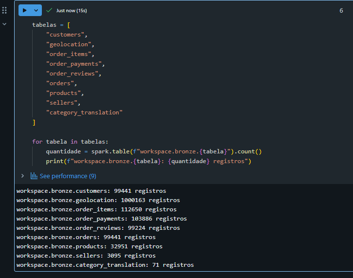

#### Evidência 2 — Tabelas criadas na camada Bronze

A consulta ao schema `workspace.bronze` confirma a criação das nove tabelas Delta correspondentes aos arquivos do conjunto de dados.

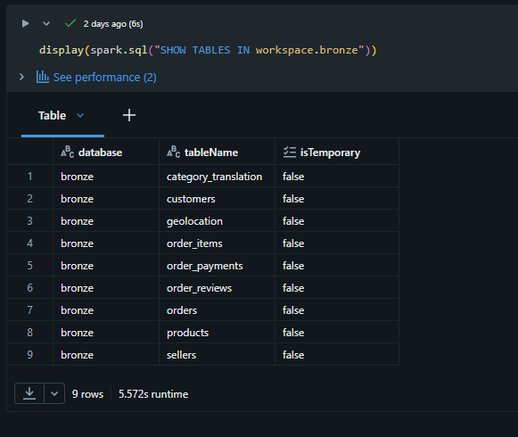

### 7.2. Verificações de qualidade da camada Bronze

Após a ingestão dos nove arquivos CSV, foram realizadas verificações de qualidade para compreender as características dos dados recebidos e identificar possíveis problemas antes da etapa de transformação.

As verificações contemplaram a presença de valores nulos, duplicidades de chaves, registros completamente duplicados e integridade referencial entre as tabelas.

#### 7.2.1. Análise de valores nulos

A primeira verificação identificou as colunas que apresentavam valores ausentes, registrando a quantidade e o percentual de nulos em relação ao total de registros de cada tabela.

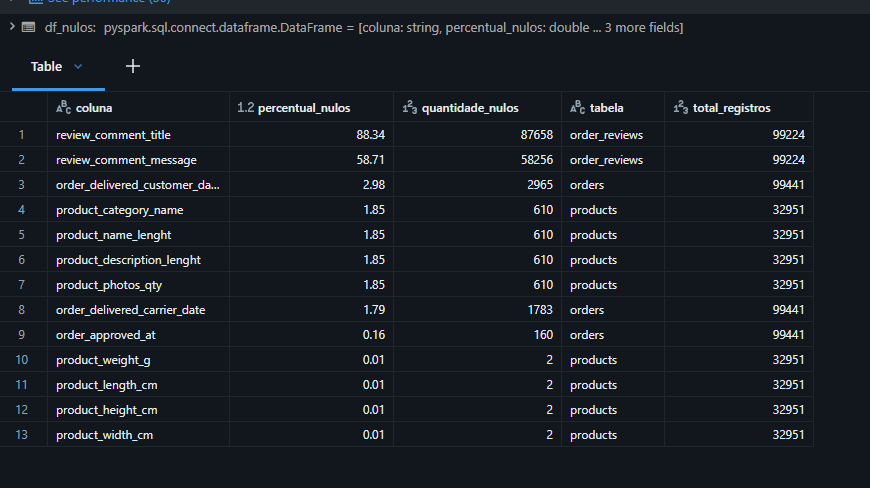

Os resultados mostraram que os campos `review_comment_title` e `review_comment_message`, da tabela de avaliações, apresentaram os maiores percentuais de valores nulos: **88,34% e 58,71%**, respectivamente.

Esses valores precisam ser interpretados de acordo com o significado dos campos, pois uma avaliação pode conter uma nota mesmo quando o cliente não escreve um título ou uma mensagem.

Também foram identificados **610 produtos sem categoria informada**, correspondentes a aproximadamente **1,85%** dos registros da tabela de produtos. Essa situação foi considerada no tratamento dos dados na camada Silver.

#### 7.2.2. Verificação de duplicidades nas chaves

Foi realizada uma análise para identificar registros excedentes com chaves repetidas nas principais entidades do conjunto de dados.

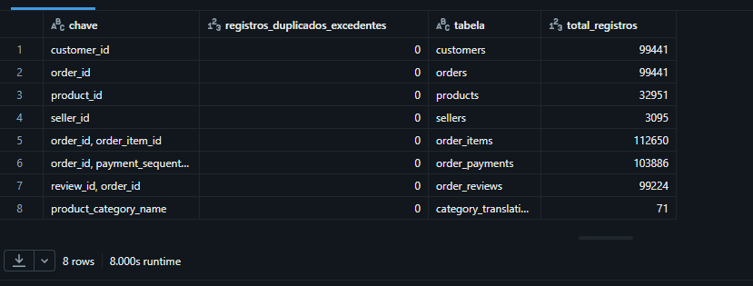

Nas oito verificações apresentadas, **não foram identificadas duplicidades excedentes nas chaves analisadas**.

Esse resultado indica que as chaves verificadas não apresentaram repetições indevidas na camada Bronze. A análise não deve ser confundida com uma garantia de ausência de duplicidades em todos os campos ou tabelas do conjunto de dados.

#### 7.2.3. Verificação de registros completamente duplicados nas avaliações

Além da análise de chaves, foi realizada uma verificação específica na tabela `order_reviews` para identificar registros completamente duplicados, considerando as colunas originais dos dados.

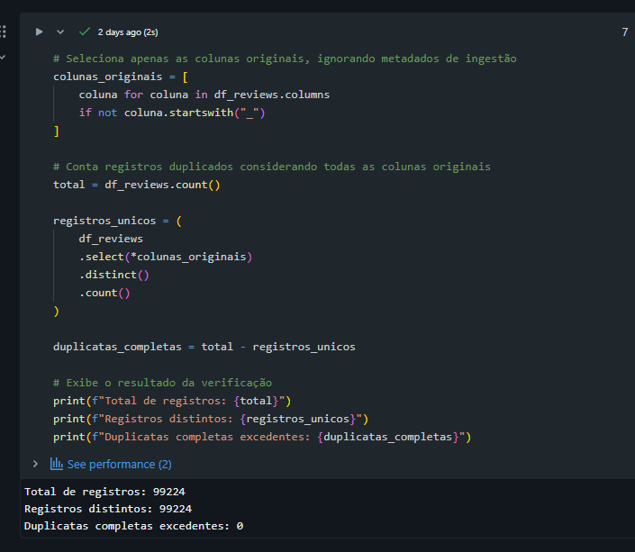

O resultado apresentou:

| Indicador | Resultado |
|---|---:|
| Total de registros | 99.224 |
| Registros distintos | 99.224 |
| Duplicatas completas excedentes | 0 |

Portanto, **não foram identificados registros completamente duplicados na tabela de avaliações** após a correção da ingestão.

#### 7.2.4. Verificação de integridade referencial

Também foram realizadas verificações para identificar registros órfãos, isto é, registros que fazem referência a identificadores não encontrados nas respectivas tabelas de destino.

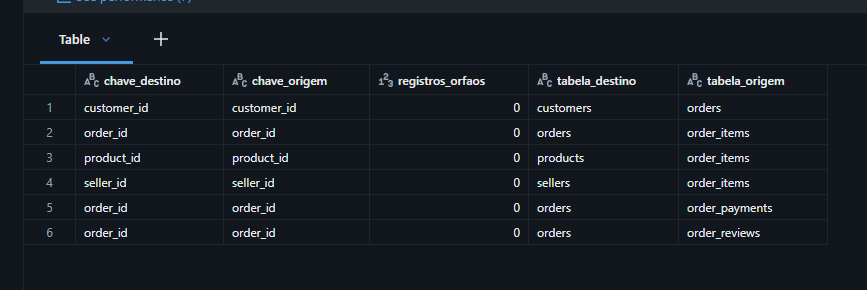

Nos seis relacionamentos apresentados, a quantidade de registros órfãos foi igual a **zero**.

Foram verificadas referências envolvendo pedidos, clientes, itens de pedidos, produtos, vendedores, pagamentos e avaliações.

O resultado indica que **não foram encontrados registros órfãos nos relacionamentos testados**, contribuindo para a confiabilidade das integrações realizadas nas etapas seguintes.

#### 7.2.5. Síntese das verificações de qualidade

As verificações da camada Bronze permitiram identificar características relevantes dos dados de origem e orientar os tratamentos posteriores.

Entre os principais resultados, destacam-se:

- Presença de campos textuais opcionais com elevados percentuais de valores nulos nas avaliações.
- Identificação de 610 produtos sem categoria informada.
- Ausência de duplicidades excedentes nas chaves verificadas.
- Ausência de registros completamente duplicados na tabela de avaliações.
- Ausência de registros órfãos nos seis relacionamentos analisados.

Esses resultados foram utilizados como referência para as decisões de limpeza, padronização e preparação dos dados na camada Silver.

### 7.3. Camada Silver — Limpeza, padronização e validação

A camada Silver foi responsável por transformar os dados recebidos da Bronze em conjuntos mais consistentes e preparados para a modelagem dimensional e as análises de negócio.

Nesta etapa, foram aplicados tratamentos de limpeza e padronização, além de verificações para avaliar os resultados das transformações.

Entre as atividades realizadas, destacam-se:

- Remoção de registros completamente duplicados na base de geolocalização.
- Tratamento de valores ausentes, considerando o significado dos campos.
- Preparação dos dados para os relacionamentos utilizados na camada Gold.
- Validação dos pedidos e classificação das entregas em relação ao prazo.
- Verificação das avaliações dos clientes após o processamento.

#### 7.3.1. Tratamento de duplicidades na geolocalização

A base de geolocalização apresentou registros completamente duplicados na camada Bronze. Para evitar a manutenção dessas repetições na base tratada, foi aplicada uma operação de remoção de duplicidades na construção da tabela Silver.

A imagem abaixo apresenta a comparação entre as quantidades de registros nas duas camadas.

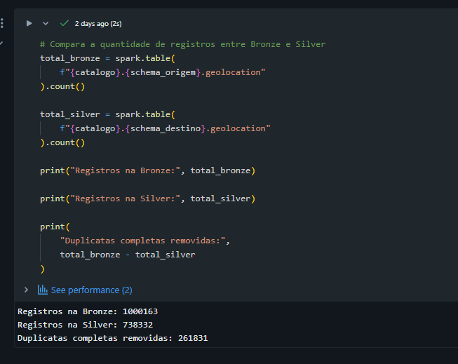

| Indicador | Quantidade |
|---|---:|
| Registros na Bronze | 1.000.163 |
| Registros na Silver | 738.332 |
| Duplicatas completas removidas | 261.831 |

A remoção de **261.831 registros completamente duplicados** reduziu a repetição de informações na base de geolocalização. A tabela resultante, com **738.332 registros**, foi armazenada no schema `workspace.silver`.

#### 7.3.2. Validação dos pedidos e prazos de entrega

Após o processamento dos pedidos, foi realizada uma verificação das informações relacionadas às entregas, permitindo identificar pedidos inconsistentes e classificar os registros de acordo com o cumprimento do prazo.

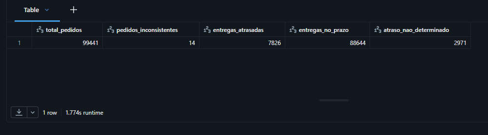

O resultado apresentou os seguintes indicadores:

| Indicador | Quantidade |
|---|---:|
| Total de pedidos | 99.441 |
| Pedidos inconsistentes | 14 |
| Entregas atrasadas | 7.826 |
| Entregas no prazo | 88.644 |
| Atraso não determinado | 2.971 |

A classificação das entregas permite distinguir pedidos entregues dentro do prazo, entregues com atraso e situações em que não foi possível determinar o atraso com base nas informações disponíveis.

Essa preparação é relevante para a pergunta de negócio que investiga a relação entre o cumprimento dos prazos de entrega e as avaliações atribuídas pelos clientes.

#### 7.3.3. Validação das avaliações dos clientes

Também foi realizada uma verificação da base de avaliações após o processamento na Silver, contemplando a quantidade de avaliações, os pedidos avaliados, a nota média e a presença de comentários.

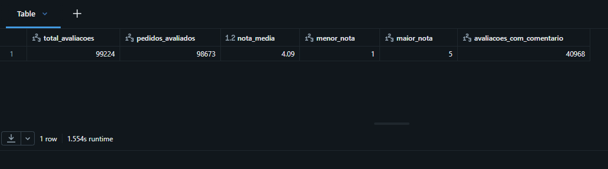

Os resultados foram:

| Indicador | Resultado |
|---|---:|
| Total de avaliações | 99.224 |
| Pedidos avaliados | 98.673 |
| Nota média | 4,09 |
| Menor nota | 1 |
| Maior nota | 5 |
| Avaliações com comentário | 40.968 |

A quantidade de avaliações é superior à quantidade de pedidos avaliados, indicando que a relação entre pedidos e avaliações não deve ser tratada automaticamente como um registro de avaliação por pedido.

A nota média observada foi de **4,09**, em uma escala de 1 a 5. Além disso, **40.968 avaliações apresentaram comentário**, enquanto as demais não necessariamente continham uma mensagem textual.

Essas verificações ajudam a compreender a estrutura dos dados antes de utilizá-los nas análises sobre a experiência dos clientes.

#### 7.3.4. Resultado da camada Silver

A camada Silver disponibilizou dados tratados e padronizados em tabelas Delta no schema `workspace.silver`.

As verificações apresentadas demonstram resultados do tratamento de duplicidades e da preparação das informações de pedidos e avaliações, que posteriormente foram utilizadas na construção do modelo dimensional da camada Gold.

### 7.4. Camada Gold — Modelagem dimensional

A camada Gold foi responsável por organizar os dados tratados da Silver em um modelo dimensional voltado à análise do negócio.

O modelo foi estruturado em **quatro tabelas dimensão e três tabelas fato**, armazenadas em formato Delta no schema `workspace.gold`.

As dimensões disponibilizam atributos que permitem contextualizar as análises, enquanto as tabelas fato representam os eventos de negócio, como pedidos, itens comercializados e pagamentos.

#### 7.4.1. Estrutura do modelo dimensional

Foram criadas as seguintes tabelas dimensão:

| Tabela | Finalidade |
|---|---|
| `dim_clientes` | Disponibilizar atributos dos clientes para análise |
| `dim_produtos` | Disponibilizar atributos e categorias dos produtos |
| `dim_tempo` | Permitir análises por períodos e datas |
| `dim_vendedores` | Disponibilizar atributos dos vendedores |

Também foram criadas três tabelas fato:

| Tabela | Finalidade |
|---|---|
| `fato_pedidos` | Analisar os pedidos e suas características |
| `fato_itens_pedido` | Analisar os itens comercializados e os valores das vendas |
| `fato_pagamentos` | Analisar os pagamentos associados aos pedidos |

#### 7.4.2. Evidência da criação das tabelas Gold

A consulta ao schema `workspace.gold` confirma a existência das sete tabelas do modelo dimensional.

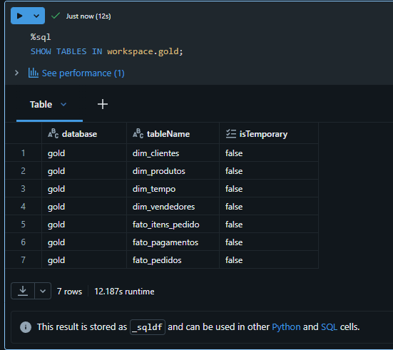

O resultado apresenta as quatro dimensões e as três tabelas fato, disponibilizadas para as consultas SQL e análises exploratórias.

#### 7.4.3. Quantidade de registros das tabelas Gold

Após a criação das tabelas, foi realizada uma consulta para verificar a quantidade de registros de cada estrutura do modelo.

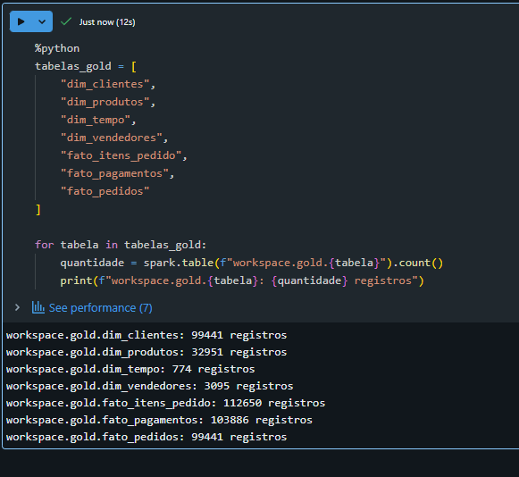

Os resultados obtidos foram:

| Tabela Gold | Quantidade de registros |
|---|---:|
| `dim_clientes` | 99.441 |
| `dim_produtos` | 32.951 |
| `dim_tempo` | 774 |
| `dim_vendedores` | 3.095 |
| `fato_itens_pedido` | 112.650 |
| `fato_pagamentos` | 103.886 |
| `fato_pedidos` | 99.441 |

As quantidades são diferentes porque as tabelas representam entidades e eventos com granularidades distintas.

A tabela `fato_pedidos`, por exemplo, apresenta **99.441 registros**, enquanto `fato_itens_pedido` apresenta **112.650 registros**, pois um pedido pode conter mais de um item.

A dimensão `dim_tempo` contém **774 registros**, disponibilizando informações de calendário para apoiar análises por período.

#### 7.4.4. Resultado da camada Gold

A construção da camada Gold disponibilizou um modelo dimensional composto por sete tabelas Delta, permitindo organizar as informações de pedidos, produtos, clientes, vendedores, pagamentos e períodos.

Essa estrutura foi utilizada como base para as consultas SQL desenvolvidas para responder às perguntas de negócio do MVP.

As tabelas e suas colunas também foram documentadas no Unity Catalog, conforme apresentado na próxima seção.

## 8. Catálogo de dados

Após a construção do modelo dimensional na camada Gold, foi realizada a documentação das tabelas e colunas no **Unity Catalog** do Databricks.

O objetivo dessa etapa foi facilitar a compreensão e a utilização das estruturas analíticas, registrando informações sobre a finalidade das tabelas e o significado de seus atributos.

A documentação foi aplicada às **sete tabelas da camada Gold e às suas 54 colunas**.

### 8.1. Documentação das tabelas

Foram cadastradas descrições para as quatro dimensões e as três tabelas fato do modelo dimensional.

Os comentários apresentam informações sobre a finalidade das tabelas e, conforme a estrutura documentada, sua origem e granularidade.

A consulta ao `information_schema.tables` permitiu verificar os comentários registrados no catálogo.

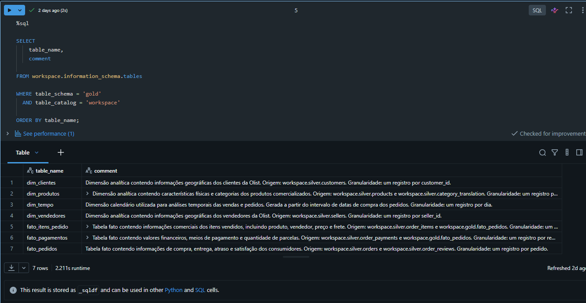

A evidência apresenta as sete tabelas Gold acompanhadas de suas respectivas descrições.

### 8.2. Documentação das colunas

Também foram cadastradas descrições para as colunas das tabelas Gold, permitindo identificar o significado dos atributos disponibilizados no modelo.

Após a documentação, foi executada uma consulta de validação para contabilizar o total de colunas e verificar a existência de atributos sem descrição.

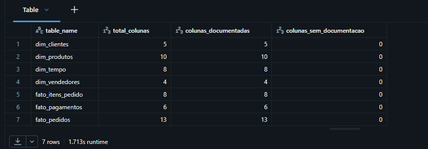

O resultado da verificação foi:

| Tabela | Total de colunas | Colunas documentadas | Colunas sem documentação |
|---|---:|---:|---:|
| `dim_clientes` | 5 | 5 | 0 |
| `dim_produtos` | 10 | 10 | 0 |
| `dim_tempo` | 8 | 8 | 0 |
| `dim_vendedores` | 4 | 4 | 0 |
| `fato_itens_pedido` | 8 | 8 | 0 |
| `fato_pagamentos` | 6 | 6 | 0 |
| `fato_pedidos` | 13 | 13 | 0 |
| **Total** | **54** | **54** | **0** |

A verificação confirmou que **todas as 54 colunas das sete tabelas Gold estavam documentadas**, sem colunas pendentes de descrição.

### 8.3. Resultado da documentação

A documentação no Unity Catalog complementou a construção do modelo dimensional, tornando mais claro o propósito das tabelas e o significado dos dados utilizados nas consultas analíticas.

Essa etapa também permitiu verificar de forma objetiva a cobertura da documentação, por meio da consulta aos metadados do catálogo.

## 9. Análises exploratórias e perguntas de negócio

Após a construção e documentação das tabelas da camada Gold, foram realizadas consultas SQL no Databricks para responder às perguntas de negócio definidas para o MVP.

As análises utilizaram dados históricos do Brazilian E-Commerce Public Dataset by Olist, principalmente do período de 2016 a 2018. Os resultados apresentados nesta seção descrevem o comportamento registrado nesse conjunto de dados e não representam a situação atual da empresa.

As consultas e os resultados estão disponíveis no notebook [`06_analise_exploratoria_olist.ipynb`](notebooks/06_analise_exploratoria_olist.ipynb).

### 9.1. Distribuição dos pedidos por status

**Pergunta de negócio:** Qual é a distribuição dos pedidos por status e qual percentual foi efetivamente entregue?

A consulta à tabela `workspace.gold.fato_pedidos` agrupou os pedidos por status e calculou a quantidade e o percentual de cada situação.

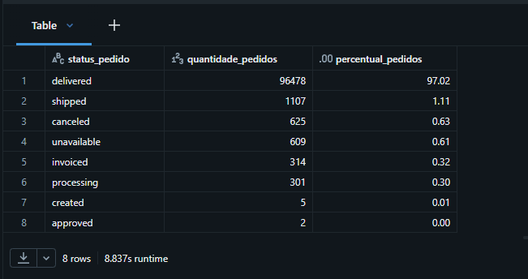

**Resultados observados:**

| Status | Quantidade de pedidos | Percentual |
|---|---:|---:|
| Entregue (`delivered`) | 96.478 | 97,02% |
| Enviado (`shipped`) | 1.107 | 1,11% |
| Cancelado (`canceled`) | 625 | 0,63% |
| Indisponível (`unavailable`) | 609 | 0,61% |
| Faturado (`invoiced`) | 314 | 0,32% |
| Em processamento (`processing`) | 301 | 0,30% |
| Criado (`created`) | 5 | 0,01% |
| Aprovado (`approved`) | 2 | 0,00% |

**Interpretação:** Dos 99.441 pedidos registrados, 96.478 apresentam status de entrega concluída, correspondendo a 97,02% do total. Os pedidos cancelados e indisponíveis representam, juntos, aproximadamente 1,24%.

A análise fornece uma visão inicial da situação operacional dos pedidos e serve de base para investigar os prazos de entrega e a satisfação dos consumidores.

### 9.2. Evolução mensal do faturamento

**Pergunta de negócio:** Como o faturamento bruto dos itens vendidos evoluiu ao longo do tempo?

A análise agrupou os dados por mês, utilizando `fato_itens_pedido` e `dim_tempo`. O indicador de faturamento total considera o valor dos produtos acrescido do frete, sem dedução de custos, cancelamentos ou devoluções.

Para evitar distorções provocadas por períodos incompletos nas extremidades do dataset, a consulta apresentada considera os meses de janeiro de 2017 a agosto de 2018.

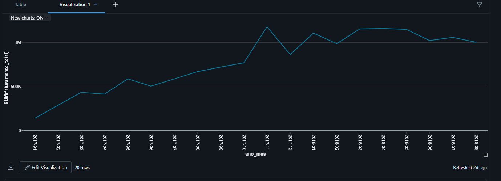

**Interpretação:** O gráfico mostra crescimento expressivo do faturamento ao longo de 2017. Novembro de 2017 registrou aproximadamente **R$ 1,18 milhão** em faturamento bruto, com **7.451 pedidos**.

Esse aumento pode estar associado a fatores sazonais, como a Black Friday, mas a consulta, isoladamente, não permite confirmar sua causa.

Nos primeiros meses de 2018, o faturamento permaneceu em patamares elevados, ultrapassando R$ 1 milhão em diversos meses analisados.

### 9.3. Evolução do ticket médio mensal

**Pergunta de negócio:** Como o valor médio dos pedidos evoluiu ao longo do tempo?

O ticket médio foi calculado pela divisão do faturamento bruto dos itens, incluindo frete, pela quantidade de pedidos distintos em cada mês.

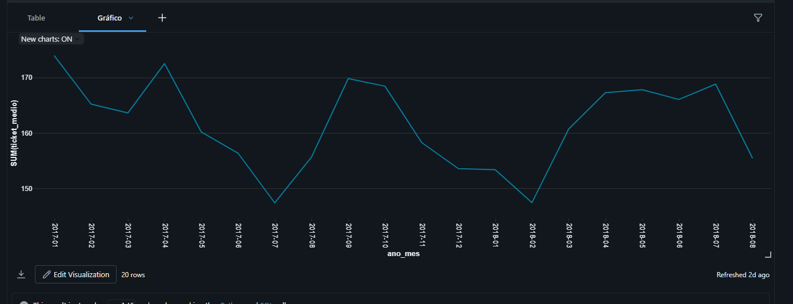

**Interpretação:** O ticket médio apresentou oscilações ao longo do período, sem acompanhar proporcionalmente o crescimento do faturamento.

Entre janeiro e novembro de 2017:

- A quantidade mensal de pedidos passou de **789 para 7.451**, aumento aproximado de **844%**.
- O ticket médio passou de **R$ 173,88 para R$ 158,25**, redução aproximada de **9%**.

Assim, no intervalo comparado, o crescimento do faturamento esteve associado principalmente ao aumento do volume de pedidos, e não ao aumento do valor médio por pedido.

### 9.4. Faturamento por categoria de produto

**Pergunta de negócio:** Quais categorias de produtos apresentam maior participação no faturamento do e-commerce?

A consulta relacionou `fato_itens_pedido` e `dim_produtos`, agrupando os valores por categoria analítica.

Nesta análise, o faturamento considera **somente o valor dos produtos**, sem incluir o frete.

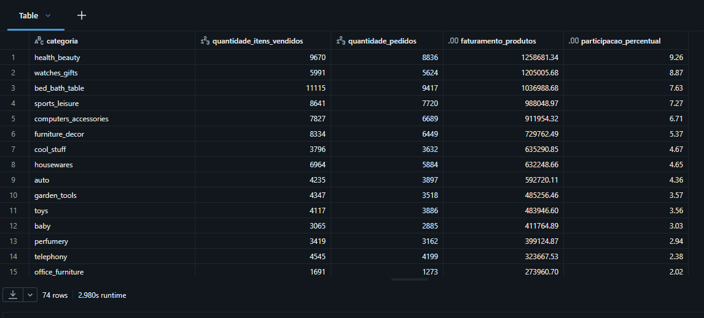

**Resultados observados:**

| Categoria | Faturamento dos produtos | Participação |
|---|---:|---:|
| Beleza e saúde (`health_beauty`) | R$ 1.258.681,34 | 9,26% |
| Relógios e presentes (`watches_gifts`) | R$ 1.205.005,68 | 8,87% |
| Cama, mesa e banho (`bed_bath_table`) | R$ 1.036.988,68 | 7,63% |
| Esporte e lazer (`sports_leisure`) | R$ 988.048,97 | 7,27% |
| Informática e acessórios (`computers_accessories`) | R$ 911.954,32 | 6,71% |

**Interpretação:** A categoria de beleza e saúde apresentou o maior faturamento entre as categorias analisadas, com aproximadamente **R$ 1,26 milhão**, representando **9,26%** do faturamento dos produtos.

As cinco primeiras categorias concentraram aproximadamente **39,74%** do valor comercializado.

A comparação entre faturamento e quantidade de itens também mostra que maior volume de unidades vendidas não implica necessariamente maior faturamento, pois os valores dos produtos variam entre categorias.

### 9.5. Distribuição geográfica do faturamento

**Pergunta de negócio:** Quais estados brasileiros apresentam maior participação no faturamento do e-commerce?

A análise relacionou os pedidos aos dados dos clientes e agrupou o faturamento por estado de residência do consumidor.

Portanto, a distribuição geográfica apresentada corresponde à **localização dos clientes**, e não à dos vendedores.

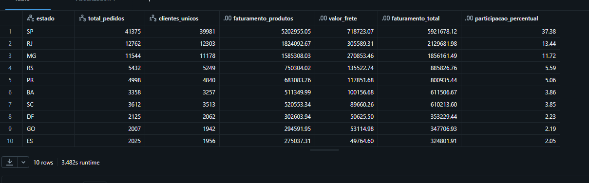

**Resultados observados:**

| Estado | Faturamento total | Participação |
|---|---:|---:|
| São Paulo (SP) | R$ 5.921.678,12 | 37,38% |
| Rio de Janeiro (RJ) | R$ 2.129.681,98 | 13,44% |
| Minas Gerais (MG) | R$ 1.856.161,49 | 11,72% |
| Rio Grande do Sul (RS) | R$ 885.826,76 | 5,59% |
| Paraná (PR) | R$ 800.935,44 | 5,06% |

**Interpretação:** O faturamento apresentou concentração nos estados da região Sudeste.

São Paulo respondeu por **37,38%** do faturamento analisado, seguido pelo Rio de Janeiro (**13,44%**) e por Minas Gerais (**11,72%**).

Juntos, esses três estados representaram aproximadamente **62,54%** do faturamento, evidenciando a participação expressiva dos consumidores do Sudeste nas operações registradas no dataset.

### 9.6. Logística e satisfação dos consumidores

**Pergunta de negócio:** Qual é a relação entre o cumprimento dos prazos de entrega e a satisfação dos consumidores?

A análise utilizou a tabela `workspace.gold.fato_pedidos`, que reúne informações de pedidos, entregas e avaliações.

Os pedidos foram agrupados conforme a situação do prazo de entrega para comparar a nota média de avaliação e o tempo médio de entrega.

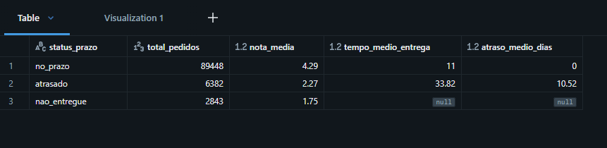

**Resultados observados:**

| Situação do prazo | Pedidos | Nota média | Tempo médio de entrega |
|---|---:|---:|---:|
| No prazo | 89.448 | 4,29 | 11 dias |
| Atrasado | 6.382 | 2,27 | 33,82 dias |
| Não entregue | 2.843 | 1,75 | Não aplicável |

Entre os pedidos atrasados, o atraso médio registrado foi de **10,52 dias**.

**Interpretação:** Os resultados mostram uma associação entre o cumprimento dos prazos de entrega e as avaliações dos consumidores.

Os pedidos entregues no prazo apresentaram nota média de **4,29**, enquanto os pedidos atrasados registraram média de **2,27**. Os pedidos classificados como não entregues apresentaram média de **1,75**.

Além disso, o tempo médio de entrega dos pedidos atrasados foi de **33,82 dias**, aproximadamente três vezes o tempo médio dos pedidos entregues no prazo.

Essa diferença destaca a relevância do acompanhamento dos prazos de entrega para compreender a experiência dos consumidores. A análise identifica uma associação nos dados históricos, sem estabelecer, por si só, uma relação causal.

### 9.7. Síntese das análises

As consultas demonstraram a utilização do modelo dimensional da camada Gold para responder a perguntas de negócio sobre o e-commerce da Olist.

Os resultados permitiram identificar a distribuição dos pedidos por status, a evolução do faturamento e do ticket médio, a participação das categorias de produtos, a concentração geográfica das vendas e a relação entre logística e avaliações dos consumidores.

Dessa forma, o pipeline desenvolvido não se limitou ao armazenamento e tratamento dos arquivos originais: os dados foram organizados em estruturas analíticas e utilizados para produzir indicadores e interpretações relacionados ao problema de negócio definido para o MVP.

## 10. Organização do repositório

Os notebooks estão disponíveis na pasta [`notebooks/`](notebooks/).

| Notebook | Descrição |
|---|---|
| `00_setup_ambiente.ipynb` | Configuração inicial do ambiente |
| `01_ingestao_bronze.ipynb` | Ingestão dos arquivos CSV na camada Bronze |
| `02_qualidade_bronze.ipynb` | Verificações de qualidade dos dados Bronze |
| `03_transformacao_silver.ipynb` | Limpeza e transformação para a camada Silver |
| `04_modelagem_gold.ipynb` | Construção do modelo dimensional Gold |
| `05_catalogo_dados.ipynb` | Documentação das tabelas e colunas |
| `06_analise_exploratoria_olist.ipynb` | Consultas e análises exploratórias |

A pasta [`evidencias/`](evidencias/) contém as imagens utilizadas para documentar visualmente os resultados apresentados neste relatório.

---

## 11. Como reproduzir o projeto

1. Obter os arquivos CSV na página do dataset da Olist no Kaggle.
2. Criar um ambiente no Databricks com acesso a Spark e Delta Lake.
3. Disponibilizar os arquivos no volume `/Volumes/workspace/bronze/olist_raw`, ou adaptar o caminho no notebook de ingestão.
4. Executar os notebooks na ordem numérica, de `00` a `06`.

**Observação:** os arquivos `.ipynb` documentam o desenvolvimento e podem incluir resultados de execuções anteriores. Para reproduzir o pipeline, é necessário configurar o ambiente e disponibilizar os dados de origem.

---
## 12. Conclusão

O MVP atingiu o objetivo de desenvolver um pipeline de Engenharia de Dados para integrar, tratar e disponibilizar os dados históricos do Brazilian E-Commerce Public Dataset by Olist em uma estrutura adequada à análise de negócio.

A solução foi implementada no Databricks seguindo a arquitetura Medallion. A camada Bronze recebeu os arquivos CSV de origem; a Silver realizou os tratamentos de limpeza e padronização; e a Gold organizou os dados em um modelo dimensional composto por quatro dimensões e três tabelas fato.

As verificações de qualidade e a documentação no Unity Catalog contribuíram para tornar os dados mais consistentes, organizados e compreensíveis para utilização analítica.

Por meio das consultas SQL, foi possível responder às perguntas de negócio definidas no início do projeto, explorando a evolução das vendas, o ticket médio, a participação das categorias de produtos, a distribuição geográfica do faturamento, os status dos pedidos e a relação entre os prazos de entrega e as avaliações dos consumidores.

Dessa forma, o projeto demonstrou a aplicação prática de conceitos de Engenharia de Dados em um fluxo completo, desde a ingestão dos arquivos de origem até a produção de informações para apoiar a análise do negócio.

### 12.1. Autoavaliação do MVP

Considero que o MVP cumpriu seu objetivo principal e proporcionou uma experiência prática com as etapas de construção de um pipeline de Engenharia de Dados. Além da implementação técnica, o desenvolvimento permitiu compreender melhor a importância da qualidade, da organização e da documentação dos dados para sua utilização em análises.

#### Principais dificuldades e aprendizados

A principal dificuldade ocorreu durante a ingestão do arquivo de avaliações da Olist. Inicialmente, a quantidade de registros obtida não correspondia à esperada, devido à presença de quebras de linha em campos textuais. Foi necessário revisar a configuração de leitura do CSV, corrigir a ingestão e executar novamente as verificações.

Essa situação demonstrou que uma execução concluída sem erro não garante, por si só, que os dados tenham sido carregados corretamente. A conferência das quantidades de registros e a compreensão das características dos arquivos são importantes para evitar que problemas na origem sejam propagados para as demais camadas.

Outro aprendizado relevante foi compreender que nem todo valor nulo representa um erro. Na base de avaliações, por exemplo, os campos de título e mensagem podem estar vazios mesmo quando o cliente atribuiu uma nota. Por isso, os tratamentos de qualidade precisam considerar o significado de cada atributo, em vez de simplesmente eliminar todos os registros com informações ausentes.

A identificação e a remoção de registros completamente duplicados na base de geolocalização também demonstraram a importância da limpeza dos dados antes de sua disponibilização para consumo analítico.

Durante a construção da camada Gold, aprofundei minha compreensão sobre modelagem dimensional, especialmente sobre a diferença entre dimensões e tabelas fato e sobre a importância de definir a granularidade de cada tabela. A documentação no Unity Catalog reforçou que disponibilizar dados não é suficiente: também é necessário tornar seu conteúdo compreensível para quem irá utilizá-los.

Por fim, a elaboração das consultas SQL e a interpretação dos resultados ajudaram a conectar o trabalho técnico de Engenharia de Dados às perguntas de negócio que motivaram o projeto.

#### Limitações do projeto

O MVP utiliza um conjunto de dados público e histórico, concentrado principalmente entre 2016 e 2018. Dessa forma, os resultados descrevem o período representado no dataset e não refletem a situação atual da Olist.

A reprodução do projeto depende da configuração de um ambiente Databricks e da disponibilização dos arquivos CSV originais, que não foram incluídos no repositório GitHub.

Outra limitação é que o pipeline foi desenvolvido para um conjunto de arquivos previamente conhecido, sem implementação de ingestão contínua ou atualização automática dos dados.

As análises realizadas são exploratórias e descritivas. Embora permitam identificar padrões e associações, como a diferença entre as avaliações de pedidos entregues no prazo e com atraso, elas não são suficientes para estabelecer relações de causa e efeito.

#### Possibilidades de evolução

Como evolução do projeto, seria possível automatizar a execução das etapas do pipeline, reduzindo a necessidade de executar manualmente os notebooks.

Outra melhoria seria implementar testes de qualidade recorrentes, com verificações automáticas das quantidades de registros, duplicidades, valores ausentes e integridade referencial a cada nova carga de dados.

O projeto também poderia ser ampliado para trabalhar com atualizações incrementais, aproximando a solução de um cenário em que novos pedidos, pagamentos e avaliações são incorporados periodicamente.

Na parte analítica, seria possível desenvolver novas perguntas de negócio e construir painéis interativos para facilitar a consulta aos indicadores de vendas, entregas e satisfação dos consumidores.

Essas possibilidades representam caminhos para ampliar a solução desenvolvida, mas não fazem parte do escopo implementado neste MVP.
